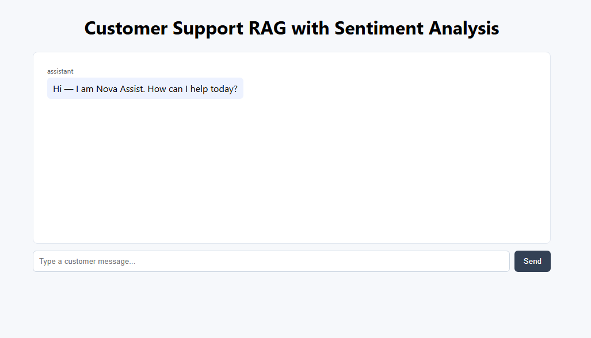

# 🌟 Customer Support RAG with Sentiment Analysis

<div align="center">
  
</div>

<p align="center">
  <a href="https://your-deployed-app-link">
    
  </a>
  <a href="LICENSE">
    
  </a>
  <a href="https://github.com/your-username/customer-support-rag/stargazers">
    
  </a>
</p>

---

## 🎯 Project Overview

<div style="background-color:#f0f8ff; padding:15px; border-radius:10px;">
This is a **Retrieval-Augmented Generation (RAG)** system for customer support that:
<ul>
  <li>Retrieves relevant help articles from a <b>knowledge base</b></li>
  <li>Performs <b>real-time sentiment analysis</b></li>
  <li>Predicts <b>escalation patterns</b></li>
  <li>Generates <b>empathetic AI responses</b></li>
</ul>
Built using <b>MERN stack</b> + <b>Gemini API</b>.
</div>

---

## ✨ Key Features

<table>
<tr>
<th>Feature</th>
<th>Description</th>
<th>Icon</th>
</tr>
<tr>
<td>Knowledge Base Processing</td>
<td>Efficiently indexes help articles for fast retrieval</td>
<td>📚</td>
</tr>
<tr>
<td>Real-Time Sentiment Analysis</td>
<td>Detects customer mood to adapt responses</td>
<td>😊</td>
</tr>
<tr>
<td>Escalation Prediction</td>
<td>Recognizes tickets likely to escalate</td>
<td>⚠️</td>
</tr>
<tr>
<td>Empathetic Response Generation</td>
<td>Generates context-aware, empathetic replies</td>
<td>🗨️</td>
</tr>
<tr>
<td>Customer Satisfaction Tracking</td>
<td>Collects feedback to optimize support</td>
<td>📊</td>
</tr>
<tr>
<td>Multi-turn Conversation Handling</td>
<td>Maintains context across messages</td>
<td>🔄</td>
</tr>
</table>

---

## 🌐 Live Demo

<div align="center">
  <a href="https://rag-frontend-mauve.vercel.app/">Click here to view the Live Demo 🚀</a>
</div>


---

## 🛠️ Tech Stack

<div style="display:flex; flex-wrap:wrap; gap:10px;">
  
  
  
  
  
  
</div>

---

## 📂 Project Structure

```plaintext
customer-support-rag/
├─ backend/
│   ├─ src/
│   │   ├─ routes/       # API routes
│   │   ├─ services/     # Logic
│   │   ├─ models/       # Mongoose models
│   │        
│   └─ server.js
|   |-.env
├─ frontend/
│   ├─ src/
│   │   ├─ App.js         # Reusable UI
│   │   ├─ main.js        
│   │   └─ styles     
│   └─ App.js
├─ assets/               # Images & GIFs
├─ README.md
└─ package.json

⚙️ Setup & Installation
Backend
git clone https://github.com/your-username/customer-support-rag.git
cd customer-support-rag/backend
npm install


Create .env:

PORT=8080
MONGO_URI=your_mongodb_connection_string
GEMINI_API_KEY=your_gemini_api_key


Start backend:

npm start

Frontend
cd ../frontend
npm install
npm start

🔄 System Workflow
<div align="center">  </div>
flowchart TD
    A[User Query] --> B[Frontend Capture]
    B --> C[RAG Retrieval]
    C --> D[Vector Database]
    D --> E[Sentiment Analysis]
    E --> F[Gemini API Response Generation]
    F --> G[Empathetic Response]
    G --> H[Feedback Loop & Metrics]


📝 Contribution

Fork the repository

Create branch: git checkout -b feature/your-feature

Commit changes: git commit -m "Add feature"

Push branch: git push origin feature/your-feature

Open Pull Request


🙏 Acknowledgements

Gemini API

HuggingFace Embeddings

MERN Stack community resources

Made with ❤️ by Ananta Kumari (Nova)

